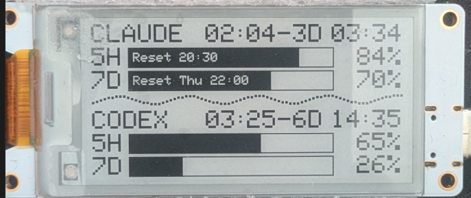

# E-Ink-ai-usage-dashboard

Claude and Codex usage-limit dashboard on a **Heltec Wireless Paper V1.2**
E-Ink display (ESP32-S3, 2.13"). A small Python server on your machine reads
your local Claude/Codex usage, exposes it as JSON, and the E-Ink board polls
it over WiFi and draws two usage bars per app.



## Architecture

```
Ubuntu server               WiFi (LAN)              Heltec Wireless Paper V1.2
┌─────────────────────┐                          ┌──────────────────────────────┐
│ usage_dashboard.py  │  GET /state.json         │ ESP32-S3 firmware            │
│ - reads Claude API  │ ◄──────────────────────  │ - polls /state.json every 60s│
│   rate-limit headers│                          │ - parses JSON (ArduinoJson)  │
│ - reads Codex       │ ──────────────────────►  │ - draws 4 usage bars         │
│   rollout logs      │  200 OK, JSON            │ - shows OFFLINE / STALE      │
└─────────────────────┘                          │   on WiFi/server failure     │
                                                 └──────────────────────────────┘
```

- The server never talks to the E-Ink board directly — it just serves
  `GET /state.json` on the LAN.
- The firmware never talks to Anthropic/OpenAI directly — it only ever
  fetches from your own server.

## `/state.json` shape

```json
{
  "claude": {
    "ok": true,
    "h5":   { "used_pct": 21.0, "reset": 1788093000 },
    "week": { "used_pct": 38.0, "reset": 1788465600 }
  },
  "codex": {
    "ok": true,
    "h5":   { "used_pct": 100.0, "reset": 1788095638 },
    "week": { "used_pct": 16.0,  "reset": 1788682438 }
  }
}
```

`used_pct` may be an integer or a float (e.g. `21.0`) — the firmware handles
both.

## Hardware

**Heltec Wireless Paper V1.2** — ESP32-S3 with an integrated 2.13"
black/white E-Ink panel and WiFi. See [`docs/hardware.md`](docs/hardware.md)
for details, including how to identify your board revision if you have an
older Wireless Paper (V1 / V1.1 / V1.1.1).

## Quick Start

### 1. Server (Ubuntu / Linux, Python 3, stdlib only)

```bash
cd server
python3 usage_dashboard.py
# → serving http://localhost:8791/state.json
#   (also serves a small live web view at http://localhost:8791/)
```

No `pip install` needed — see [`server/requirements.txt`](server/requirements.txt).
To run it as a background service, copy
[`server/usage-dashboard.service.example`](server/usage-dashboard.service.example)
to `/etc/systemd/system/usage-dashboard.service`, edit the placeholders, then:

```bash
sudo systemctl daemon-reload
sudo systemctl enable --now usage-dashboard.service
```

Data sources:
- **Codex**: reads the most recent `rate_limits` block from your local
  `~/.codex/sessions/**/rollout-*.jsonl` files. Only entries with
  `limit_id == "codex"` and real `primary`/`secondary` window objects are
  accepted — Codex also logs other `limit_id` types (e.g. `"premium"`) with
  `primary`/`secondary` set to `null`, which must be ignored so they don't
  overwrite a previously seen valid Codex data point with zeroes. See
  [`server/usage_dashboard.py`](server/usage_dashboard.py) (`_valid_codex_rate_limits`)
  and the regression test in `server/tests/test_read_codex.py`.
- **Claude**: reads your existing OAuth access token from
  `~/.claude/.credentials.json` (read-only, never modified/renewed) and makes
  a minimal `max_tokens: 1` probe call every 5 minutes to read the
  `anthropic-ratelimit-unified-*` response headers. Each probe counts
  minimally against your own Claude usage.

### 2. Firmware (PlatformIO)

Install PlatformIO (CLI or VS Code extension):

```bash
pip install platformio
# or: https://platformio.org/install/cli
```

Configure your WiFi and server address:

```bash
cd firmware
cp include/secrets.example.h include/secrets.h
$EDITOR include/secrets.h   # set WIFI_SSID, WIFI_PASSWORD, DASHBOARD_HOST
```

`include/secrets.h` is git-ignored — it never gets committed. Until it's
filled in, the display just shows "CONFIG MISSING" instead of guessing at
network settings.

Build and upload:

```bash
pio run
pio run -t upload --upload-port /dev/ttyUSB0
pio device monitor -p /dev/ttyUSB0 -b 115200   # optional: watch serial logs
```

## Firmware details

- **Board config**: `platformio.ini` targets `board = heltec_wifi_lora_32_V3`
  with `framework = arduino`. This is the correct PlatformIO board id for the
  Wireless Paper's ESP32-S3 — Heltec reuses the LoRa-32-V3 board definition
  for it.
- **`build_flags = -D WIRELESS_PAPER` is required.** The `heltec-eink-modules`
  library compiles a different (and otherwise `= delete`d) constructor for the
  Wireless Paper's display controller depending on this flag. Without it,
  the build fails with an error like `use of deleted function
  'E0213A367::E0213A367(...)'`.
- **Display class**: `EInkDisplay_WirelessPaperV1_2`, an alias the library
  resolves to its `E0213A367` display driver.
- **JSON parsing**: [`ArduinoJson`](https://arduinojson.org/) v7
  (`bblanchon/ArduinoJson`), pinned in `platformio.ini`. `used_pct` is read as
  a float and rounded, since the server may emit `21.0` rather than `21`.
- **Polling**: the firmware fetches `/state.json` every 60 seconds
  (`POLL_INTERVAL_MS`). The E-Ink panel is only redrawn when the rendered
  content actually changes, to avoid unnecessary refreshes (E-Ink displays
  degrade / flicker with excessive full refreshes).
- **OFFLINE / STALE**: the last known-good values are always kept on screen.
  If WiFi is down, a small `OFFLINE` marker appears; if WiFi is up but the
  server request/JSON fails or reports invalid data, a small `STALE` marker
  appears instead. Values are never reset to 0 on a failed fetch.
- **Usage bars**: each of the four rows (Claude 5H/7D, Codex 5H/7D) is drawn
  as a real outlined rectangle with a proportional black fill for the
  percentage — not Unicode block characters — so it stays crisp on the
  E-Ink panel. At 100%, a small "LIMIT" label is stamped in white on the
  filled bar.

## Repository layout

```
server/     Python usage API (stdlib only) + systemd unit example
firmware/   PlatformIO project for the Heltec Wireless Paper V1.2
docs/       Hardware notes and images
```

## Third-party dependencies

This repository's own code is MIT-licensed. The firmware additionally
depends on the external PlatformIO library `heltec-eink-modules`, which is
loaded at build time via `lib_deps` and is not included in this repository.
That library's own license is not clearly stated, and it bundles
GPLv3-licensed code (`GFX_Root`) alongside MIT-licensed code (`SdFat`). This
repository does not distribute any pre-compiled firmware binaries — see
[`THIRD_PARTY_NOTICES.md`](THIRD_PARTY_NOTICES.md) for details.

## License

[MIT](LICENSE)
